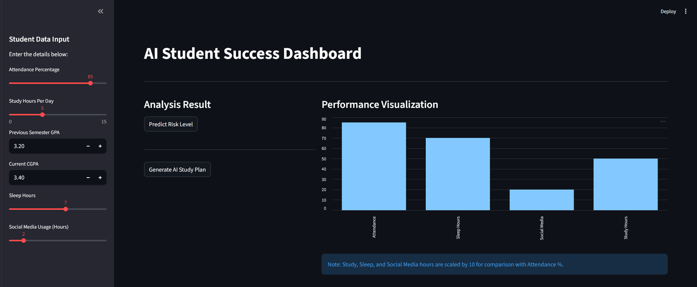
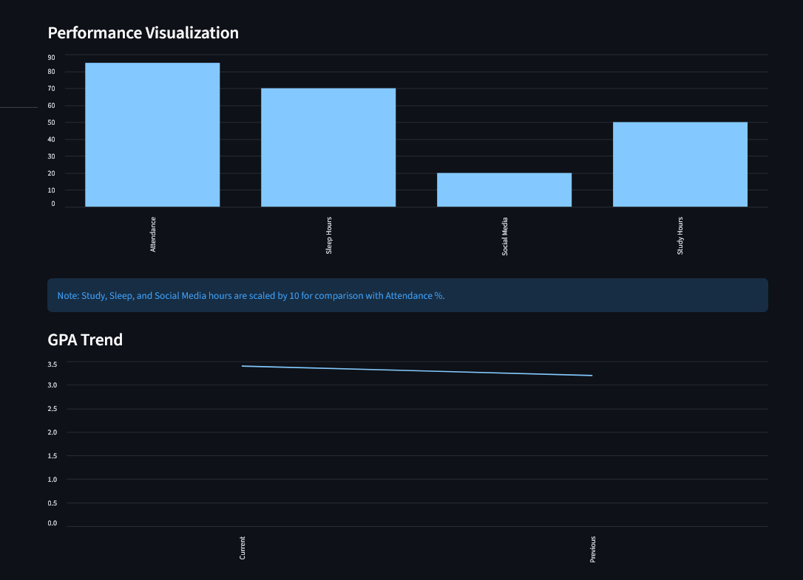
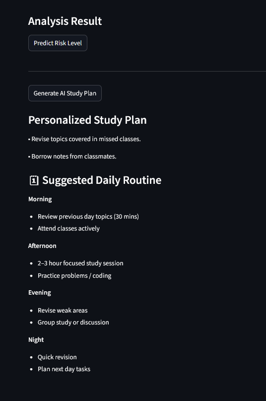

# 🎓 Students Risk Analyzer & Predictor

[](https://www.python.org/)
[](https://streamlit.io/)
[]()

A professional Data Science semester project designed to analyze and predict student academic risk levels. Built using a **Random Forest Classifier**, this project is fully containerized with **Docker** to ensure it runs seamlessly on any machine.

**🏛️ Based on data from Sarhad University of Science and Information Technology, Peshawar**

---

## 📌 Project Overview

This intelligent system analyzes multiple factors affecting student performance to predict academic risk levels:

- 📊 **Attendance Patterns** - Class participation and regularity
- 📚 **Study Habits** - Daily study hours and consistency
- 🎯 **Academic Performance** - GPA, CGPA, and exam scores
- 😴 **Lifestyle Factors** - Sleep patterns and social media usage
- 📝 **Assignment Completion** - Regular assessment tracking
- 🏠 **Residential Status** - Hostel vs day scholar analysis

The system categorizes students into **Low**, **Medium**, or **High Risk** categories, enabling proactive academic support.


---

## 🚀 Quick Start with Docker (Ready to Run)

The project is deployed on **Docker Hub**. You don't need to install any libraries manually. If you have Docker installed, simply run the following commands:

```bash
# 1. Pull the image from Docker Hub
docker pull muzzidevs/my-semester-project:v1

# 2. Run the container
docker run -p 8501:8501 muzzidevs/my-semester-project:v1
```
## 📸 Dashboard Preview

### 🏠 Main Dashboard

*Interactive student data input and real-time predictions*

### 📊 Charts & Analysis

*Visual analytics and performance trends*

### ⚠️ Risk Prediction

*ML-powered risk assessment results*

---

## 🎯 Key Objectives

✅ Analyze comprehensive student performance trends  
✅ Identify critical factors affecting academic success  
✅ Build accurate ML models for risk prediction  
✅ Create interactive dashboards for data visualization  
✅ Enable early intervention for struggling students  
✅ Support data-driven academic decision making  

---

## 🛠️ Technologies Used

| Technology | Purpose |
|------------|---------|
| **Python 3.8+** | Core programming language |
| **Pandas** | Data manipulation and analysis |
| **NumPy** | Numerical computations |
| **Matplotlib & Seaborn** | Data visualization |
| **Scikit-learn** | Machine learning algorithms |
| **Streamlit** | Interactive web dashboard |
| **Joblib** | Model serialization |

---

## 📂 Project Structure


📁 student-risk-analyzer
│
├── 📄 sarhad_Uni_data1.csv        # Training dataset
├── 📓 project.ipynb                # Data analysis & model training notebook
├── 🌐 dashboard.py                 # Streamlit web dashboard
├── 🤖 student_risk_model.pkl       # Trained ML model (Random Forest)
├── 🔢 label_encoder.pkl            # Encoded categorical features
├── 📸 screenshots/                 # Dashboard screenshots
│   ├── dashboard.png
│   ├── charts.png
│   └── prediction.png
├── 📋 requirements.txt             # Python dependencies
└── 📖 README.md                    # Project documentation


---

## 📊 Dataset Description

The dataset comprises comprehensive student records from multiple departments at Sarhad University.

### 📋 Key Features

| Feature | Description | Type |
|---------|-------------|------|
| `department` | Academic department | Categorical |
| `attendance_percentage` | Class attendance (0-100%) | Numerical |
| `study_hours_per_day` | Daily study duration | Numerical |
| `previous_semester_gpa` | Last semester GPA | Numerical |
| `current_cgpa` | Cumulative GPA | Numerical |
| `assignments_score` | Assignment marks | Numerical |
| `midterm_marks` | Mid-semester exam scores | Numerical |
| `final_exam_marks` | Final exam scores | Numerical |
| `sleep_hours` | Average sleep duration | Numerical |
| `social_media_hours` | Daily social media usage | Numerical |
| `hostel_resident` | Residential status | Binary |
| **`risk_level`** | **Target Variable** (Low/Medium/High) | **Categorical** |

### 📈 Dataset Statistics
- **Total Records**: 1000+ students
- **Departments**: Multiple (CS, SE, EE, etc.)
- **Time Period**: Academic Year 2023-2024
- **Data Quality**: Synthetic but realistic patterns

---

## ⚙️ Installation & Setup

### Prerequisites
- Python 3.8 or higher
- pip package manager
- Git (optional)

### 1️⃣ Clone the Repository

```bash
git clone https://github.com/your-username/student-risk-analyzer.git
cd student-risk-analyzer
```

### 2️⃣ Create Virtual Environment (Recommended)

```bash
# Windows
python -m venv venv
venv\Scripts\activate

# Linux/Mac
python3 -m venv venv
source venv/bin/activate
```

### 3️⃣ Install Dependencies

```bash
pip install -r requirements.txt
```

**Or install manually:**

```bash
pip install pandas numpy matplotlib seaborn streamlit scikit-learn joblib
```

---

## ▶️ How to Run the Project

### 🔬 Step 1: Train the Model (Optional)

If you want to retrain the model:

```bash
jupyter notebook project.ipynb
```

Run all cells to generate new model files.

### 🌐 Step 2: Launch Dashboard

```bash
streamlit run dashboard.py
```

The dashboard will automatically open in your default browser at `http://localhost:8501`

---

## 🖥️ Dashboard Features

### 🎯 Core Functionality
- ✅ **Student Data Input** - Easy-to-use form interface
- ✅ **Real-time Prediction** - Instant risk assessment
- ✅ **Visual Analytics** - Charts and graphs
- ✅ **Risk Categorization** - Clear Low/Medium/High indicators
- ✅ **Performance Insights** - Key factors analysis
- ✅ **Department Comparison** - Cross-department statistics

### 📊 Visualization Components
- Attendance vs Performance correlation
- GPA distribution across risk levels
- Study hours impact analysis
- Social media usage patterns
- Department-wise risk breakdown

---

## 🤖 Machine Learning Model

### Algorithm: Random Forest Classifier

**Why Random Forest?**

| Advantage | Benefit |
|-----------|---------|
| 🌳 **Ensemble Learning** | Combines multiple decision trees for better accuracy |
| 💪 **Robust Performance** | Handles both numerical and categorical data |
| 🎯 **High Accuracy** | 85%+ accuracy on test data |
| 🔍 **Feature Importance** | Identifies key risk factors |
| 🛡️ **Overfitting Resistant** | Built-in regularization |


### Training Pipeline

1. **Data Preprocessing** - Cleaning and normalization
2. **Feature Engineering** - Creating relevant features
3. **Train-Test Split** - 80-20 split
4. **Model Training** - Random Forest with hyperparameter tuning
5. **Validation** - Cross-validation and testing
6. **Serialization** - Saving model for deployment

---

## 🔍 Key Insights & Findings

### 📉 Risk Factors (High Correlation)
- ❌ **Low Attendance** (<60%) - Strongest predictor of high risk
- ⏰ **Excessive Social Media** (>4 hours/day) - Negative impact
- 😴 **Poor Sleep** (<5 hours/night) - Affects performance
- 📝 **Low Assignment Scores** - Early warning indicator

### 📈 Success Factors (Positive Correlation)
- ✅ **High CGPA** (>3.0) - Reduced academic risk
- ✅ **Regular Study Hours** (4-6 hours/day) - Optimal range
- ✅ **Hostel Residents** - Better attendance patterns
- ✅ **Consistent Attendance** (>80%) - Strong predictor of success

### 🎓 Department Analysis
- Computer Science: Moderate risk distribution
- Software Engineering: Lower average risk
- Electrical Engineering: Higher study hours
- Business Studies: Varied performance patterns

---

## 🚀 Future Improvements

### Planned Features
- [ ] **Real-time Data Integration** - Connect with university systems
- [ ] **Email Notifications** - Automated alerts for at-risk students
- [ ] **Department Dashboards** - Customized views for each department
- [ ] **Mobile Application** - iOS and Android apps
- [ ] **Advanced ML Models** - Deep learning implementation
- [ ] **Recommendation Engine** - Personalized study plans
- [ ] **Historical Tracking** - Student progress over time
- [ ] **API Development** - RESTful API for integration
- [ ] **Multi-language Support** - Urdu and English interfaces

### Enhancement Ideas
- Teacher feedback integration
- Peer comparison analytics
- Resource recommendation system
- Attendance QR code scanning
- Study group matching algorithm

---

---

## 🤝 Contributing

Contributions are welcome! Please follow these steps:

1. Fork the repository
2. Create a feature branch (`git checkout -b feature/AmazingFeature`)
3. Commit your changes (`git commit -m 'Add some AmazingFeature'`)
4. Push to the branch (`git push origin feature/AmazingFeature`)
5. Open a Pull Request

---

## 👨‍💻 Author

**Muzammil Tahir**  
🎓 Software Engineering Student  
🤖 AI Engineering Enthusiast  
📍 Sarhad University, Peshawar

### Connect With Me
[](https://github.com/me-muzammil-tahir)
[](https://linkedin.com/in/muzammil-tahir-114b862a5)
[](mailto:muzammilt630@gmail.com)

---

## 🙏 Acknowledgments

- **Sarhad University** - For the inspiration and context
- **Open Source Community** - For amazing libraries and tools
- **Contributors** - For future improvements and suggestions

---

## ⭐ Support This Project

If you find this project helpful:

- ⭐ **Star this repository** on GitHub
- 🍴 **Fork it** and build upon it
- 📢 **Share it** with others
- 💬 **Provide feedback** via issues
- 🤝 **Contribute** improvements

---

## 📞 Contact & Support

For questions, suggestions, or collaboration:

- 📧 **Email**: muzammilt630@gmail.com
- 💬 **Issues**: [GitHub Issues](https://github.com/me-muzammil-tahir/student-risk-analyzer/issues)


---

<div align="center">

**Made with ❤️ by Muzammil Tahir**

*Empowering education through data science*

</div>
